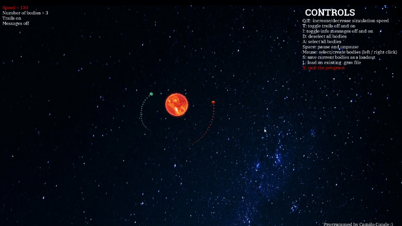

# GravSim
A 2D Gravitation Simulator

FEATURES

- Hard coded physics engine

- Data visualization for selected orbital bodies
  - If a body is selected by left clicking AND it is the only selected body, its Vx, Vy, mass, and potential will be displayed
  - This data can otherwise be obtained for any body by hovering the mouse over it

- Right click and hold for creation of new bodies + manipulation of existing ones 
  - The longer you hold the button, you larger the created body will be
  - When creating bodies, the outline of the new body will grow for a couple seconds, then shrink. This sudden shrink means you will now       create a planet, not an asteroid, when you release.

- Toggleable trails and mass-increase messages

- Functional (and imo very beautiful) collision system! 
  - Asteroids combine on collision, creating a more massive body
  - Asteroids are absorbed into planets on collision
  - A planet colliding with another planet or a gas giant will destroy both and create asteroids
  
- You can click 'S' to save a serialized copy of all bodies and their info, then load it later with 'L'

KNOWN PROBLEMS
  
- Clickboxes for bodies, particularly very small or very large ones, being too big

- Fullscreen mode acting wonky on some machines

- Lag spikes when asteroids rapidly combine to form planets

- Very rarely, the simulator will crash upon a collision, especially if there already exist many bodies

- Font not loading (because I didn't include the code to read it in yet :p)

Example Collision

Example Collision with data display

